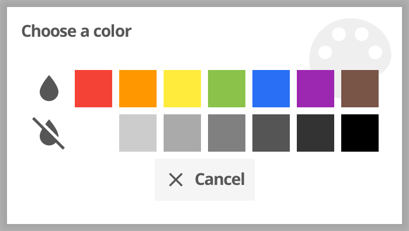
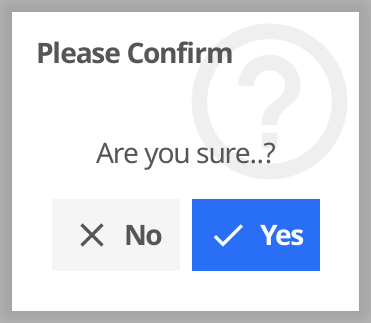
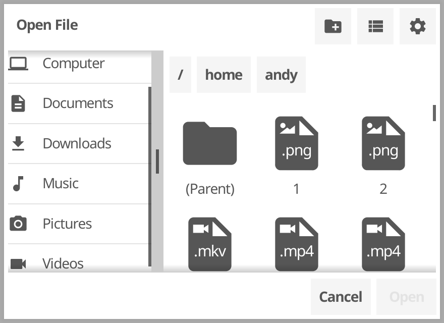
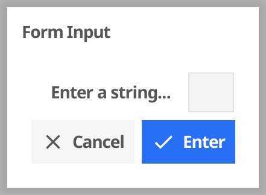
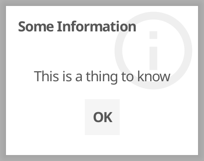
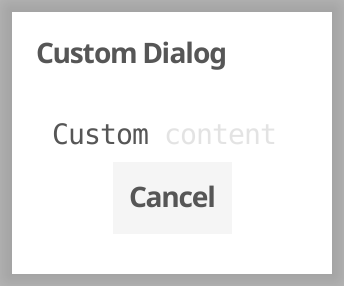

+++
title = "对话框列表"
date = 2023-08-14T08:53:36+08:00
weight = 50
type = "docs"
description = ""
isCJKLanguage = true
draft = false

+++

# Dialog List - 对话框列表

https://developer.fyne.io/explore/dialogs

## 标准对话框 Standard Dialogs

------

### 颜色 Color

Allow users to pick a colour from a standard set (or any color in advanced mode).

​	允许用户从标准集中选择颜色（或在高级模式下选择任何颜色）。

### 确认 Confirm

Ask for conformation of an action.

​	询问用户是否确认执行某项操作。

### 打开文件 FileOpen

Present this to ask user to choose a file to use inside the app. The actual dialog displayed will depend on the current operating system.

​	展示给用户一个用于选择在应用程序内使用的文件的对话框。实际显示的对话框将取决于当前操作系统。

### 表单 Form

Get various input elements in a dialog, with validation.

​	在对话框中获取各种输入元素，并进行验证。

### 信息 Information

A simple way to present some information to the app user.

​	向应用程序用户展示一些信息的简单方式。

### 自定义 Custom

Present any content inside a dialog container.

​	在对话框容器中呈现任何内容。

