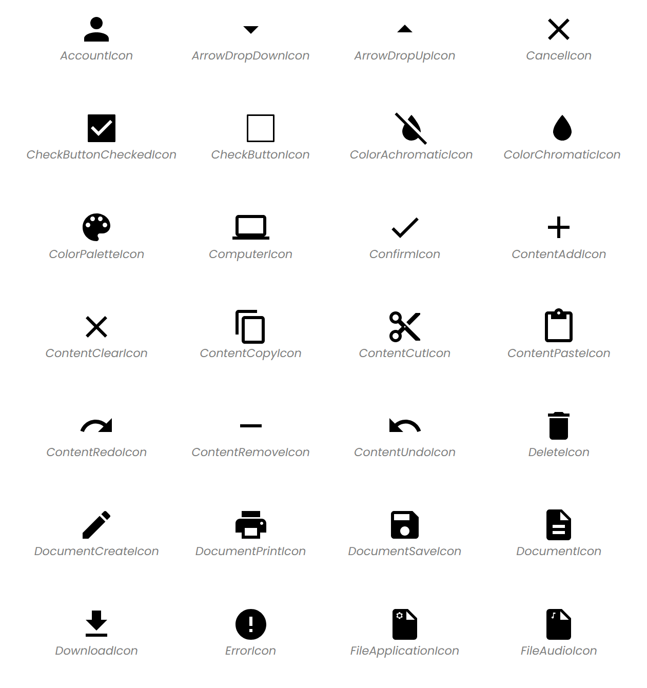
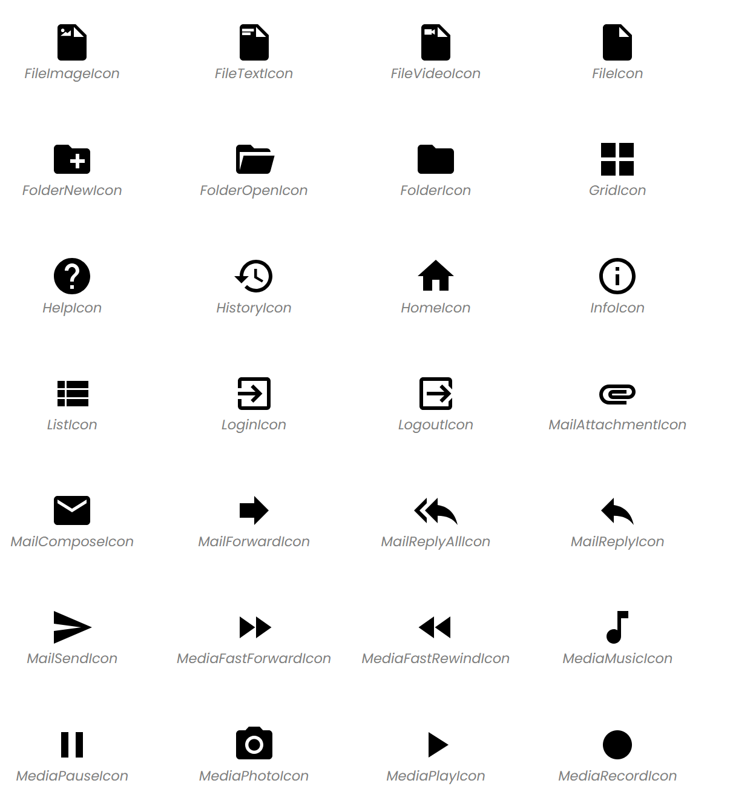
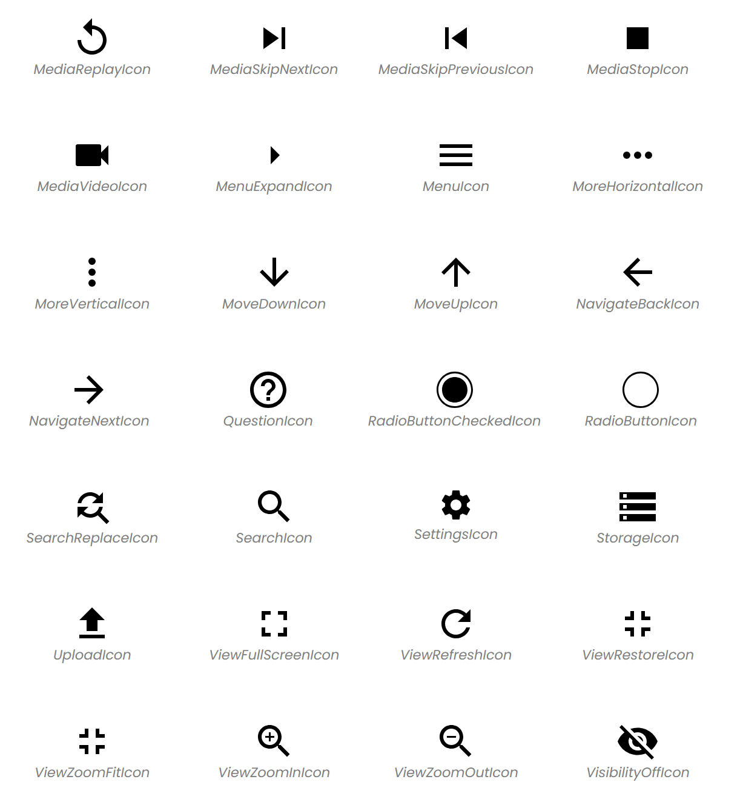
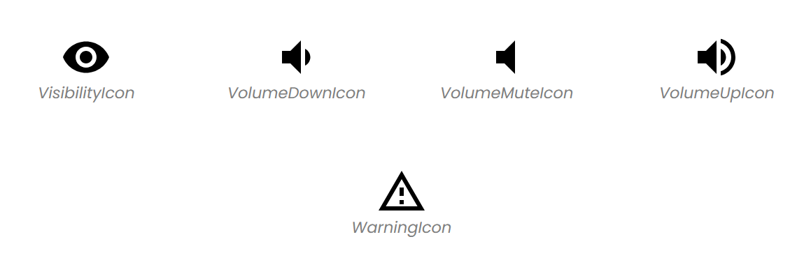

+++
title = "主题图标"
date = 2023-08-14T08:53:49+08:00
weight = 60
type = "docs"
description = ""
isCJKLanguage = true
draft = false

+++

# Theme Icons - 主题图标

https://developer.fyne.io/explore/icons

Each of the following icons is available via the `theme` package as a function. For example `theme.InfoIcon()`.

​	以下每个图标都可以通过 `theme` 包中的函数获得。例如 `theme.InfoIcon()`。

The icons are also available via their source icon name by using the `ThemeIconName` with the `Icon` method on a struct implementing `fyne.Theme`. For example `theme.Icon(theme.IconNameInfo)`.

​	这些图标还可以通过它们的源图标名称使用实现了 `fyne.Theme` 接口的结构体上的 `Icon` 方法来获取，使用 `ThemeIconName`。例如 `theme.Icon(theme.IconNameInfo)`。

## 图标列表 List

## 使用其他颜色集 Using other color sets

Each icon can be used as a source for a particular themed color using the various public helper methods:

​	每个图标都可以作为特定主题颜色的源，使用以下公共辅助方法之一：

- `NewDisabledThemedResource`
- `NewErrorThemedResource`
- `NewInvertedThemedResource`
- `NewPrimaryThemedResource`

By default, all icons adapt to the current theme foreground using `NewThemedResource` which uses the theme foreground color. All Icons are SVG `width="24"`, `height="24"`.

​	默认情况下，所有图标都会根据当前主题前景色进行适配，使用 `NewThemedResource` 来使用主题前景色。所有图标都是 SVG 格式，`width="24"`，`height="24"`。