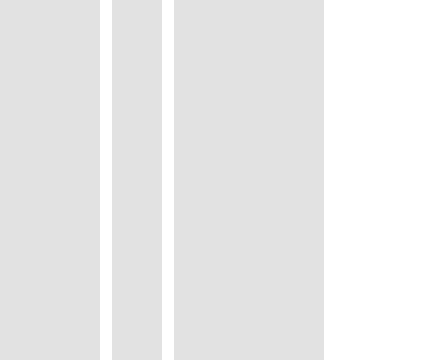
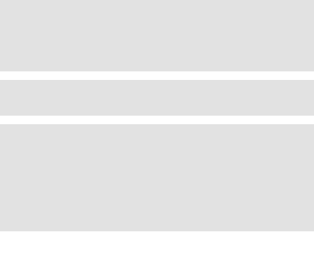
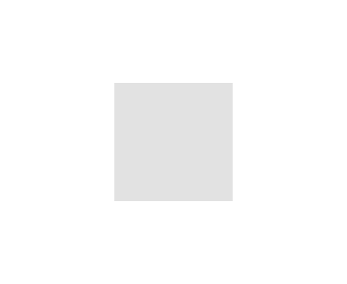
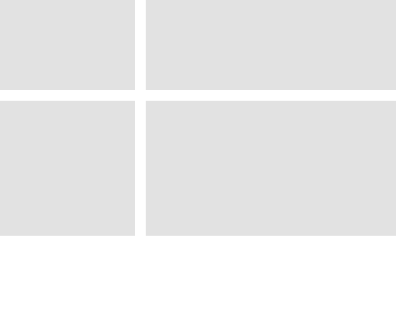
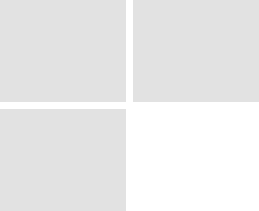
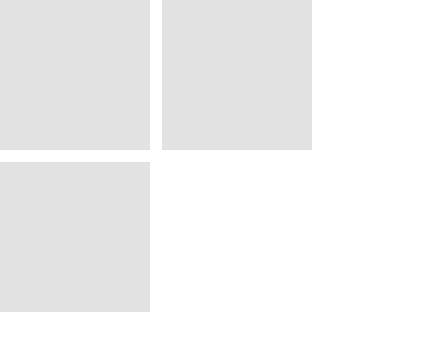
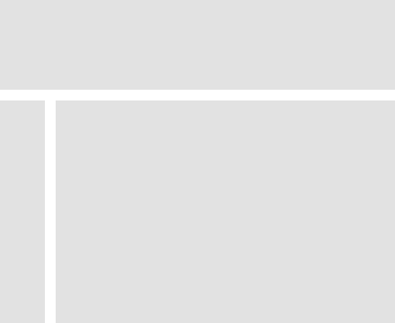
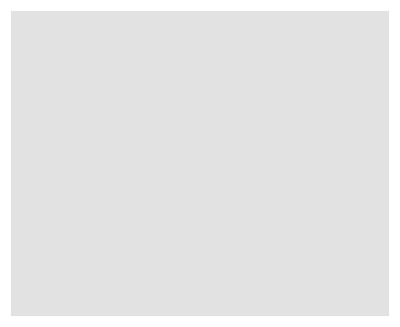
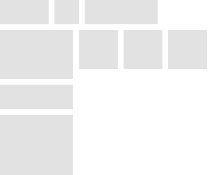

+++
title = "布局列表"
date = 2023-08-14T08:53:25+08:00
weight = 40
type = "docs"
description = ""
isCJKLanguage = true
draft = false

+++

# Layout List -  布局列表

https://developer.fyne.io/explore/layouts

## 标准布局 Standard Layouts

------

### 水平盒子（HBox） - Horizontal Box (HBox)

Horizontal Box arranges items in a horizontal row. Every element will have the same height (the height of the tallest item in the container) and objects will be left-aligned at their minimum width.

​	水平盒子在水平行中排列项目。每个元素都将具有相同的高度（容器中最高项的高度），对象将在其最小宽度处左对齐。

### 垂直盒子（VBox） - Vertical Box (VBox)

Vertical Box arranges items in a vertical column. Every element will have the same width (the width of the widest item in the container) and objects will be top-aligned at their minimum height.

​	垂直盒子在垂直列中排列项目。每个元素都将具有相同的宽度（容器中最宽项的宽度），对象将在其最小高度处顶部对齐。

### Center

Center layout positions all container elements in the center of the container. Every object will be set to it’s minimum size.

​	居中布局将所有容器元素置于容器的中心。每个对象都将设置为其最小尺寸。

### Form

Form layout arranges items in pairs where the first column is at minimum width. This is normally useful for labelling elements in a form, where the label is in the first column and the item it describes is in the second. You should always add an even number of elements to a form layout.

​	表单布局将项目成对排列，其中第一列的宽度最小。通常情况下，这对于在表单中为元素添加标签很有用，其中标签位于第一列，描述的项位于第二列。您应该始终将偶数个元素添加到表单布局中。

### 网格 Grid

Grid layout arranges items equally in the available space. A number of columns is specified, with objects being positioned horizontally until the number of columns is reached at which point a new row is started. All objects have the same size, that is width divided by column total and the height will be total height divided by the number of rows required. Minus padding.

​	网格布局在可用空间中均匀排列项目。指定了多个列，对象会水平地定位，直到达到列数，然后会开始新的行。所有对象的尺寸都相同，即宽度除以总列数，高度将是总高度除以所需的行数。减去填充。

### GridWrap

GridWrap layout arranges all items to flow along a row, wrapping to a new row if there is insufficient space. All objects will be set to the same size, which is the size passed to the layout. This layout may not respect item MinSize to manage this uniform layout. Often used in file managers or image thumbnail lists.

​	网格换行布局将所有项目沿一行流动排列，如果空间不足，则换行到新的行。所有对象都将设置为相同的大小，即传递给布局的大小。该布局可能不会尊重项目的最小尺寸，以管理这种统一布局。通常用于文件管理器或图像缩略图列表。

### Border

Border layout supports positioning of items at the outside of available space. The border is passed pointers to the objects for (top, left, bottom, right). All items in the container that are not positioned on a border will fill the remaining space.

​	边框布局支持将项目定位在可用空间的外部。边框为对象（上、左、下、右）传递指针。容器中未定位在边框上的所有项将填充剩余空间。

### Max

Max layout positions all container elements to fill the available space. The objects will all be full-sized and drawn in the order they were added to the container (last-most is on top).

​	最大布局将所有容器元素定位以填充可用空间。对象将全部具有全尺寸，并按照它们添加到容器的顺序绘制（最后一个在顶部）。

### Padded

Padded layout positions all container elements to fill the available space but with a small padding around the outside. The size of the padding is theme specific. The objects will all be drawn in the order they were added to the container (last-most is on top).

​	填充布局将所有容器元素定位以填充可用空间，但在外部周围留有一小块填充。填充的大小与主题有关。对象将按照它们添加到容器的顺序绘制（最后一个在顶部）。

## 组合布局 Combining Layouts

It is possible to build up more complex application structures by using multiple layouts. Multiple containers that each have their own layout can be nested to create complete user interface arrangements using only the standard layouts listed above. For example a horizontal box for a header, a vertical box for a left side file panel and a grid wrap layout in the content area - all inside a container using a border layout can build the result illustrated below.

​	通过使用多个布局，可以构建更复杂的应用程序结构。每个具有自己布局的多个容器可以嵌套，使用上面列出的标准布局来创建完整的用户界面布局。例如，水平盒子用于标题，垂直盒子用于左侧文件面板，以及内容区域中的网格换行布局 - 所有这些都在一个使用边框布局的容器中，可以构建下面示例中的结果。

