+++
title = "小部件列表"
date = 2023-08-14T08:53:15+08:00
weight = 30
type = "docs"
description = ""
isCJKLanguage = true
draft = false

+++

# Widget List - 小部件列表

https://developer.fyne.io/explore/widgets

## 标准小部件（位于 `widget` 包中） - Standard Widgets (in `widget` package)

------

### Accordion

Accordion displays a list of AccordionItems. Each item is represented by a button that reveals a detailed view when tapped.

​	Accordion 显示 AccordionItems 的列表。每个项目由一个按钮表示，在点击时会显示详细视图。

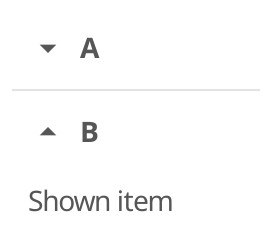

### Button

[Button](https://developer.fyne.io/widget/button) widget has a text label and icon, both are optional.

​	[Button](https://developer.fyne.io/widget/button) 小部件具有文本标签和图标，都是可选的

### Card

Card widget groups elements with a header and subheader, all are optional.

​	Card 小部件将元素分组并带有标题和子标题，这些都是可选的。

### Check

Check widget has a text label and a checked (or unchecked) icon.

​	Check 小部件具有文本标签和已选（或未选）图标。

### Entry

[Entry](https://developer.fyne.io/widget/entry) widget allows simple text to be input when focused.

​	[Entry](https://developer.fyne.io/widget/entry) 小部件允许在焦点时输入简单的文本。

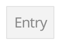

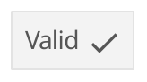

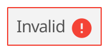

PasswordEntry widget hides text input and adds a button to display the text.

​	PasswordEntry 小部件隐藏文本输入，并添加一个按钮以显示文本。

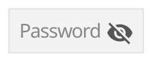

### FileIcon

FileIcon provides helpful standard icons for various types of file. It displays the type of file as an indicator icon and shows the extension of the file type.

​	FileIcon 为不同类型的文件提供有用的标准图标。它以指示图标的形式显示文件的类型，并显示文件类型的扩展名。

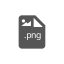

### Form

[Form](https://developer.fyne.io/widget/form) widget is two column grid where each row has a label and a widget (usually an input). The last row of the grid will contain the appropriate form control buttons if any should be shown.

​	[Form](https://developer.fyne.io/widget/form) 小部件是一个两列网格，每一行都有一个标签和一个小部件（通常是输入）。网格的最后一行将包含适当的表单控制按钮，如果需要的话。

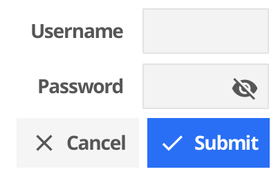

### Hyperlink

Hyperlink widget is a text component with appropriate padding and layout. When clicked, the URL opens in your default web browser.

​	Hyperlink 小部件是一个带有适当填充和布局的文本组件。单击后，URL 将在默认的网络浏览器中打开。

### Icon

Icon widget is a basic image component that load’s its resource to match the theme.

​	Icon 小部件是一个基本的图像组件，根据主题加载其资源。

### Label

[Label](https://developer.fyne.io/widget/label) widget is a label component with appropriate padding and layout.

​	[Label](https://developer.fyne.io/widget/label) 小部件是一个带有适当填充和布局的标签组件。

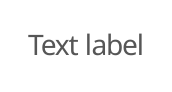

### Progress bar

[ProgressBar](https://developer.fyne.io/widget/progressbar) widget creates a horizontal panel that indicates progress.

​	[ProgressBar](https://developer.fyne.io/widget/progressbar) 小部件创建一个水平面板，用于指示进度。

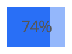

ProgressBarInfinite widget creates a horizontal panel that indicates waiting indefinitely An infinite progress bar loops 0% -> 100% repeatedly until Stop() is called.

​	ProgressBarInfinite 小部件创建一个水平面板，用于无限等待。无限进度条会重复循环从 0% 到 100%，直到调用 Stop() 为止。

### RadioGroup

RadioGroup widget has a list of text labels and radio check icons next to each.

​	RadioGroup 小部件具有一系列文本标签和每个标签旁边的单选框图标。

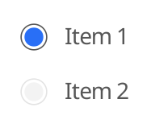

### Select

Select widget has a list of options, with the current one shown, and triggers an event function when clicked.

​	Select 小部件具有一系列选项，显示当前选项，并在点击时触发事件函数。

### SelectEntry

Select entry widget adds an editable component to the select widget. Users can select an option or enter their own value.

​	Select entry 小部件在选择小部件中添加了一个可编辑的组件。用户可以选择选项或输入自己的值。

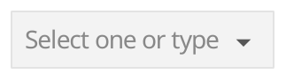

### Separator

Separator widget shows a dividing line between other elements.

​	Separator 小部件显示其他元素之间的分割线。

### Slider

Slider if a widget that can slide between two fixed values.

​	Slider 小部件可以在两个固定值之间滑动。

### TextGrid

TextGrid is a monospaced grid of characters. This is designed to be used by a text editor, code preview or terminal emulator.

​	TextGrid 是一个等宽字符网格。这是为文本编辑器、代码预览或终端仿真器设计的。

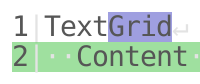

### Toolbar

[Toolbar](https://developer.fyne.io/widget/toolbar) widget creates a horizontal list of tool buttons.

​	[Toolbar](https://developer.fyne.io/widget/toolbar) 小部件创建一个水平的工具按钮列表。

## 集合小部件（位于 `widget` 包中） - Collection Widgets (in `widget` package)

Collection widgets provide advanced caching functionality to provide high performance rendering of massive data. This does lead to a more complex constructor, but is a good balance for the outcome it enables. Each of these widgets uses a series of callbacks, the minimum set is defined by their constructor function, which includes the data size, the creation of template items that can be re-used and finally the function that applies data to a widget as it is about to be added to the display.

​	集合小部件提供了高级缓存功能，以提供大量数据的高性能渲染。这确实会导致构造函数更复杂，但对于它所实现的结果是一个很好的平衡。这些小部件中的每一个都使用一系列回调函数，最小的一组由它们的构造函数定义，其中包括数据大小、可以重复使用的模板项的创建，以及将数据应用于即将添加到显示中的小部件的函数。

### List

[List](https://developer.fyne.io/collection/list) provides a high performance vertical scroll of many sub-items.

​	[List](https://developer.fyne.io/collection/list) 提供了高性能的垂直滚动显示多个子项。

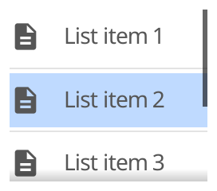

### Table

[Table](https://developer.fyne.io/collection/table) provides a high performance scrolled two dimensional display of many sub-items.

​	[Table](https://developer.fyne.io/collection/table) 提供了高性能的两维滚动显示多个子项。

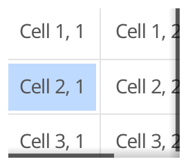

### Tree

[Tree](https://developer.fyne.io/collection/tree) provides a high performance vertical scroll of items that can be expanded to reveal child elements..

​	[Tree](https://developer.fyne.io/collection/tree) 提供了一个高性能的垂直滚动项列表，这些项可以展开以显示子元素。

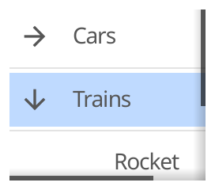

## 容器小部件（位于 `container` 包中） - Container Widgets (in `container` package)

Container widgets are like regular containers but they provide some additional functionality.

​	容器小部件类似于常规容器，但它们提供了一些附加功能。

### AppTabs

[AppTabs](https://developer.fyne.io/container/apptabs) widget allows switching visible content from a list of TabItems. Each item is represented by a button at the top of the widget.

​	[AppTabs](https://developer.fyne.io/container/apptabs) 小部件允许从 TabItems 切换可见内容。每个项目由位于小部件顶部的按钮表示。

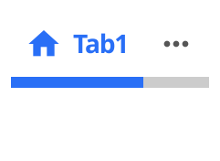

### Scroll

ScrollContainer defines a container that is smaller than the Content.

​	ScrollContainer 定义了一个小于内容大小的容器。

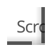

### Split

SplitContainer defines a container whose size is split between two children.

​	SplitContainer 定义了一个大小在两个子项之间分割的容器。

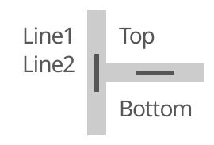