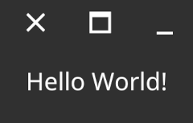
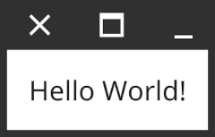

+++
title = "Hello World"
date = 2023-08-14T08:37:37+08:00
weight = 2
type = "docs"
description = ""
isCJKLanguage = true
draft = false

+++

# Hello World

https://developer.fyne.io/started/hello

## 创建你的第一个 Fyne 应用程序 - Create your first Fyne app

------

Having completed the steps in the [getting started](https://developer.fyne.io/started/) document you’re ready to build your first app. To illustrate the process we will build a simple hello world application.

​	完成了[入门指南](https://developer.fyne.io/started/)文档中的步骤后，你已经准备好构建你的第一个应用程序了。为了说明这个过程，我们将构建一个简单的 "Hello World" 应用程序。

A simple app starts by creating an app instance with `app.New()` and then opening a window with `app.NewWindow()`. Then a widget tree is defined that is set as the main content with `SetContent()` on a window. The app UI is then shown by calling `ShowAndRun()` on the window.

​	一个简单的应用程序从使用 `app.New()` 创建应用程序实例开始，然后使用 `app.NewWindow()` 打开一个窗口。接下来，定义一个部件树，该树将通过在窗口上使用 `SetContent()` 设置为主内容。最后，通过在窗口上调用 `ShowAndRun()` 显示应用程序的用户界面。

```
package main

import (
	"fyne.io/fyne/v2/app"
	"fyne.io/fyne/v2/widget"
)

func main() {
	a := app.New()
	w := a.NewWindow("Hello World")

	w.SetContent(widget.NewLabel("Hello World!"))
	w.ShowAndRun()
}
```

The code above can be built using the command `go build .` and then executed either by running the `hello` command or by double clicking the icon. You could also bypass the compiling step and just run the code directly using `go run .`.

​	以上代码可以使用命令 `go build .` 进行构建，然后通过运行 `hello` 命令或双击图标来执行。你也可以跳过编译步骤，直接使用 `go run .` 运行代码。

Either approach will show a window that looks just like this:

​	无论使用哪种方法，都会显示一个窗口，看起来就像这样：



If you prefer a light theme then just set the environment variable `FYNE_THEME=light` and you’ll get:

​	如果你更喜欢亮色主题，只需设置环境变量 `FYNE_THEME=light`，你会得到：



That’s all there is to getting started. To learn more you can read the full [API documentation](http://developer.fyne.io/api/).

​	这就是入门的全部内容。要了解更多信息，可以阅读完整的[API 文档](http://developer.fyne.io/api/)。

<iframe width="560" height="315" src="https://www.youtube.com/embed/S3T9l9QUa9I" frameborder="0" allowfullscreen="" style="box-sizing: border-box;"></iframe>