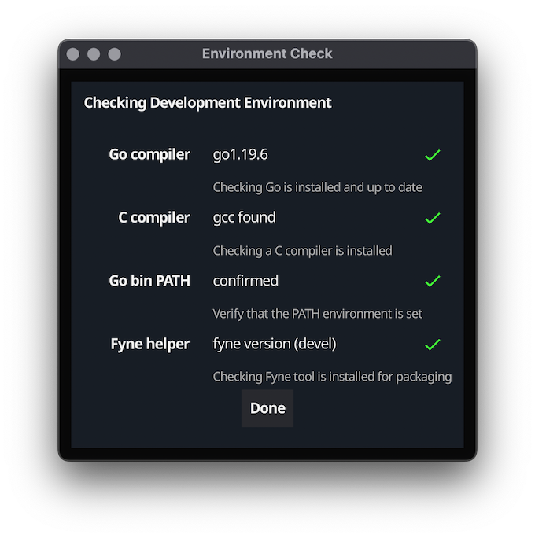

+++
title = "入门指南"
date = 2023-08-14T08:37:19+08:00
weight = 1
type = "docs"
description = ""
isCJKLanguage = true
draft = false

+++

# Getting Started

https://developer.fyne.io/started/

Using the Fyne toolkit to build cross platform applications is very simple but does require some tools to be installed before you can begin. If your computer is set up for development with Go then the following steps may not be required, but we advise reading the tips for your operating system just in case. If later steps in this tutorial fail then you should re-visit the prerequisites below.

​	使用 Fyne 工具包构建跨平台应用程序非常简单，但在开始之前需要安装一些工具。如果您的计算机已配置为使用 Go 进行开发，则可能不需要以下步骤，但我们建议根据您的操作系统阅读一些提示，以防万一。如果本教程中的后续步骤失败，则应重新检查下面的先决条件。

## 先决条件 Prerequisites

Fyne requires 3 basic elements to be present, the Go tools (at least version 1.12), a C compiler (to connect with system graphics drivers) and a system graphics driver. The instructions vary depending on your operating system, choose the appropriate tab below for installation instructions.

​	Fyne 需要满足以下三个基本要素：Go 工具（至少版本 1.12）、C 编译器（用于连接系统图形驱动程序）和系统图形驱动程序。根据您的操作系统，选择适当的选项卡以获取安装说明。

Note that these steps are just required for development - your Fyne applications will not require any setup or dependency installation for end users!

​	请注意，这些步骤仅适用于开发 - 您的 Fyne 应用程序不需要为终端用户进行任何设置或依赖项安装！







1. Download Go from the [download page](https://golang.org/dl/) and follow instructions
2. 从[下载页面](https://golang.org/dl/)下载 Go 并按照说明进行安装。
3. Install one of the available C compilers for windows, the following are tested with Go and Fyne:
4. 为 Windows 安装其中一个可用的 C 编译器，以下编译器经过与 Go 和 Fyne 的测试：
   - MSYS2 with MingW-w64 - [msys2.org](https://www.msys2.org/)
   - TDM-GCC - [tdm-gcc.tdragon.net](https://jmeubank.github.io/tdm-gcc/download/)
   - Cygwin - [cygwin.com](https://www.cygwin.com/)
5. In Windows your graphics driver will already be installed, but it is recommended to ensure they are up to date.
6. 在 Windows 中，图形驱动程序已经安装，但建议确保其是最新版本。

The steps for installing with MSYS2 (recommended) are as follows:

​	使用 MSYS2（推荐）进行安装的步骤如下：

- Install MSYS2 from [msys2.org](https://www.msys2.org/)

- 从 [msys2.org](https://www.msys2.org/) 安装 MSYS2。

- Once installed do not use the MSYS terminal that opens

- 安装完成后，请不要使用打开的 MSYS 终端。

- Open “MSYS2 MinGW 64-bit” from the start menu

- 从开始菜单中打开“MSYS2 MinGW 64-bit”。

- Execute the following commands (if asked for install options be sure to choose “all”):

- 执行以下命令（如果要求进行安装选项，请确保选择“all”）：

  ```bash
    $ pacman -Syu
    $ pacman -S git mingw-w64-x86_64-toolchain
  ```

- You will need to add /c/Program\ Files/Go/bin and ~/Go/bin to your $PATH, for MSYS2 you can paste the following command into your terminal:

- 您需要将 `/c/Program\ Files/Go/bin` 和 `~/Go/bin` 添加到 `$PATH` 中，对于 MSYS2，您可以在终端中粘贴以下命令：

  ```bash
    $ echo "export PATH=\$PATH:/c/Program\ Files/Go/bin:~/Go/bin" >> ~/.bashrc
  ```

- For the compiler to work on other terminals you will need to set up the windows %PATH% variable to find these tools. Go to the “Edit the system environment variables” control panel, tap “Advanced” and add “C:\msys64\mingw64\bin” to the Path list.

- 为使编译器在其他终端上工作，您需要设置 Windows %PATH% 变量以找到这些工具。打开“编辑系统环境变量”控制面板，点击“高级”，并将“C:\msys64\mingw64\bin”添加到 Path 列表中。





1. Download Go from the [download page](https://golang.org/dl/) and follow instructions
2. 从[下载页面](https://golang.org/dl/)下载 Go 并按照说明进行安装。
3. Install Xcode from the [Mac App Store](https://apps.apple.com/us/app/xcode/id497799835?mt=12)
4. 从[Mac App Store](https://apps.apple.com/us/app/xcode/id497799835?mt=12)安装 Xcode。
5. Set up the Xcode command line tools by opening a Terminal window and typing the following: `xcode-select --install`
6. 打开终端窗口，输入以下命令以设置 Xcode 命令行工具：`xcode-select --install`
7. In macOS the graphics drivers will already be installed.
8. 在 macOS 中，图形驱动程序已经安装。





- You will need to install Go, gcc and the graphics library header files using your package manager, one of the following commands will probably work.

- 您需要使用软件包管理器安装 Go、gcc 和图形库头文件，以下命令中的任何一个可能都适用。

- **Debian / Ubuntu:** 

  ```bash
  sudo apt-get install golang gcc libgl1-mesa-dev xorg-dev
  ```

  

- **Fedora:** 

  ```bash
  sudo dnf install golang gcc libXcursor-devel libXrandr-devel mesa-libGL-devel libXi-devel libXinerama-devel libXxf86vm-devel
  ```

  

- **Arch Linux:** 

  ```bash
  sudo pacman -S go xorg-server-devel libxcursor libxrandr libxinerama libxi
  ```

  

- **Solus:** 

  ```bash
  sudo eopkg it -c system.devel golang mesalib-devel libxrandr-devel libxcursor-devel libxi-devel libxinerama-devel
  ```

  

- **openSUSE:** 

  ```bash
  sudo zypper install go gcc libXcursor-devel libXrandr-devel Mesa-libGL-devel libXi-devel libXinerama-devel libXxf86vm-devel
  ```

  

- **Void Linux:** 

  ```bash
  sudo xbps-install -S go base-devel xorg-server-devel libXrandr-devel libXcursor-devel libXinerama-devel
  ```

  

- **Alpine Linux** 

  ```bash
  sudo apk add go gcc libxcursor-dev libxrandr-dev libxinerama-dev libxi-dev linux-headers mesa-dev
  ```

  

- **NixOS** 

  ```bash
  nix-shell -p libGL pkg-config xorg.libX11.dev xorg.libXcursor xorg.libXi xorg.libXinerama xorg.libXrandr xorg.libXxf86vm
  ```

  





- You will need to install Go, gcc and the graphics library header files using the package manager.
- 您需要使用软件包管理器安装 Go、gcc 和图形库头文件。
- `sudo apt-get install golang gcc libegl1-mesa-dev xorg-dev`





- You will need to install Go, gcc and the graphics library header files using the package manager.

- 您需要使用软件包管理器安装 Go、gcc 和图形库头文件。

- **FreeBSD:** 

  ```bash
  sudo pkg install go gcc xorg pkgconf
  ```

  

- **OpenBSD:** 

  ```bash
  sudo pkg_add go
  ```

  

- **NetBSD:** 

  ```bash
  sudo pkgin install go pkgconf
  ```

  





- To develop apps for Android you will first need to install the tools for your current computer (Windows, macOS or Linux)
- 要为 Android 开发应用程序，您首先需要安装当前计算机的工具（Windows、macOS 或 Linux）。
- Once complete you will need to install the Android SDK and Android NDK - the recommended approach is to install [Android Studio](https://developer.android.com/studio/index.html) and then go to **Tools > SDK Manager** and from **SDK Tools** install the **NDK (Side by side)** package.
- 完成后，您需要安装 Android SDK 和 Android NDK —— 推荐的方法是安装 [Android Studio](https://developer.android.com/studio/index.html)，然后转到 **工具 > SDK 管理器**，从 **SDK 工具** 安装 **NDK（并列安装）** 软件包。





- To develop apps for iOS you will need access to an Apple Mac computer, configured according to the **macOS** tab above.
- 要为 iOS 开发应用程序，您需要访问一台已按照上述 **macOS** 标签进行配置的 Apple Mac 计算机。
- You will also need to create an [Apple Developer account](https://developer.apple.com/) and sign up to the developer program (costs apply) to obtain the necessary certificate to run your app on any devices.
- 您还需要创建一个 [Apple 开发者帐户](https://developer.apple.com/) 并注册开发者计划（需支付费用）以获取在任何设备上运行您的应用所需的必要证书。





Compiling Fyne apps on Android you will need Android 9 or above

在 Android 上编译 Fyne 应用程序，您需要 Android 9 或更高版本

- Install [fdroid](https://f-droid.org/) and from there [termux](https://f-droid.org/packages/com.termux/)
- 安装 [fdroid](https://f-droid.org/)，然后从中安装 [termux](https://f-droid.org/packages/com.termux/)。
- Open Termux and install Go and Git: `pkg install golang git`
- 打开 Termux 并安装 Go 和 Git：`pkg install golang git`
- Install NDK and SDK to termux from https://github.com/Lzhiyong/termux-ndk and set enviroment variables `ANDROID_HOME` and `ANDROID_NDK_HOME`
- 从 https://github.com/Lzhiyong/termux-ndk 安装 NDK 和 SDK 到 Termux，并设置环境变量 `ANDROID_HOME` 和 `ANDROID_NDK_HOME`。

(you can get more help from [video](https://youtu.be/uGtVjf4_Ivo))

（您可以从 [视频](https://youtu.be/uGtVjf4_Ivo) 中获取更多帮助。）





## 下载 Downloading

When using Go modules (required with Go 1.16 and later), you will need to set up the module before you can use the package.

​	在使用 Go 模块（Go 1.16 及更高版本要求使用）时，您需要在使用该包之前设置模块。

### Go 模块（适用于 Go 1.16 或更高版本） - Go modules (for Go 1.16 or newer)

If you are not using modules or you already have your module initialized, you can skip this to the next step. Run the following command and replace `MODULE_NAME` with your preferred module name (this should be called in a new folder specific for your application).

​	如果您没有使用模块，或者您已经初始化了模块，则可以跳过此步骤。运行以下命令，并将 `MODULE_NAME` 替换为您首选的模块名称（应在专门为您的应用程序创建的新文件夹中执行此命令）。

```bash
$ cd myapp
$ go mod init MODULE_NAME
```

You now need to download the Fyne module and helper tool. This will be done using the following commands:

​	然后，您需要下载 Fyne 模块和辅助工具。可以使用以下命令完成：

```bash
$ go get fyne.io/fyne/v2@latest
$ go install fyne.io/fyne/v2/cmd/fyne@latest
```

If you are unsure of how Go modules work, consider reading [Tutorial: Create a Go module](https://golang.org/doc/tutorial/create-module).

​	如果您不确定 Go 模块的工作方式，可以阅读[教程：创建 Go 模块](https://golang.org/doc/tutorial/create-module)。

### 旧版 Go 安装 - Older Go installations

To install the Fyne toolkit and helper using an older Go release simply execute the go get commands:

​	要使用旧版 Go 版本安装 Fyne 工具包和辅助工具，只需执行以下 go get 命令：

```bash
$ go get fyne.io/fyne/v2
$ go get fyne.io/fyne/v2/cmd/fyne
```

## 检查您的安装 - Check your installation

Before coding an app or running an example you can check your install using the [Fyne Setup](https://geoffrey-artefacts.fynelabs.com/github/andydotxyz/fyne-io/setup/latest/) tool. Simply download the right app for your computer from the link and run it, you should see something like the following screen:

​	在编写应用程序或运行示例之前，您可以使用[Fyne 设置](https://geoffrey-artefacts.fynelabs.com/github/andydotxyz/fyne-io/setup/latest/)工具来检查您的安装。只需从链接中下载适用于您的计算机的正确应用程序，然后运行它，您应该会看到类似下面的屏幕：



If there are any problems with your installation see the [troubleshooting](https://developer.fyne.io/faq/troubleshoot) section for hints.

​	如果安装有任何问题，请参阅[故障排除](https://developer.fyne.io/faq/troubleshoot)部分获取提示。

## 运行演示 - Run the demo

If you want to see the Fyne toolkit in action before you start to code your own application, you can see our [demo app](https://github.com/fyne-io/fyne/tree/master/cmd/fyne_demo) running on your computer by executing:

​	如果您想在开始编写自己的应用程序之前看到 Fyne 工具包的实际效果，您可以通过执行以下命令，在您的计算机上运行我们的[演示应用程序](https://github.com/fyne-io/fyne/tree/master/cmd/fyne_demo)：

```bash
$ go run fyne.io/fyne/v2/cmd/fyne_demo@latest
```

Please note that the first run has to compile some C-code and can thus take longer than usual. Subsequent builds reuse the cache and will be much faster.

​	请注意，第一次运行需要编译一些 C 代码，因此可能比平常需要更长时间。随后的构建会重用缓存，速度会快得多。

### 旧版 Go 版本 - Older Go version

To run the demo on an older version of Go, simply execute the follwing command instead:

​	要在旧版 Go 上运行演示，只需执行以下命令：

```bash
$ go run fyne.io/fyne/v2/cmd/fyne_demo
```

### 安装 - Installing

If you want to, you can also install the demo using the following command (requires Go 1.16 or later):

​	如果您想要，您还可以使用以下命令安装演示应用程序（需要 Go 1.16 或更高版本）：

```bash
$ go install fyne.io/fyne/v2/cmd/fyne_demo@latest
```

For earlier versions of Go, you need to use the following command instead:

​	对于旧版 Go 版本，请改用以下命令：

```bash
$ go get fyne.io/fyne/v2/cmd/fyne_demo
```

If your `GOBIN` environment has been added to path (should be by default on macOS and Windows), you can then run the demo:

​	如果您的 `GOBIN` 环境已添加到路径（在 macOS 和 Windows 上默认情况下应该是这样），那么您可以运行演示应用程序：

```bash
$ fyne_demo
```

And that’s all there is to it! Now you can write your own Fyne application in your IDE of choice. If you want to see some Fyne code in action then you can read [your first application](https://developer.fyne.io/started/firstapp).

​	这就是全部！现在，您可以在您选择的 IDE 中编写自己的 Fyne 应用程序。如果您想要查看一些 Fyne 代码的实际效果，可以阅读[您的第一个应用程序](https://developer.fyne.io/started/firstapp)。